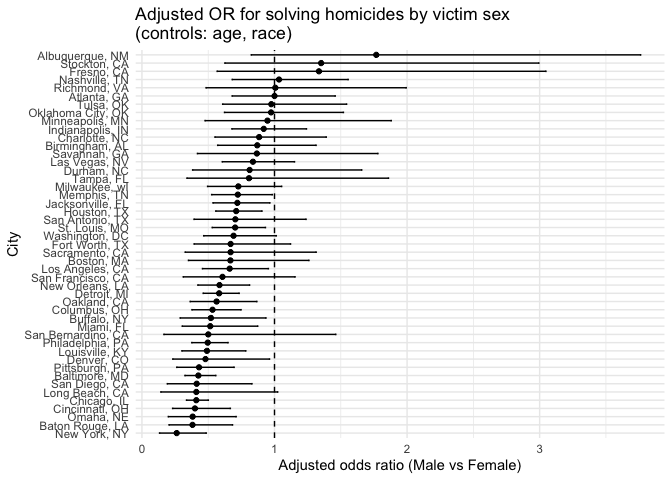

p8105_hw6_yw4660
================

## Problem 1

``` r
homicides <- read_csv(
  "data/homicide-data.csv",
  locale = locale(encoding = "ISO-8859-1")
)
```

    ## Rows: 52179 Columns: 12
    ## ── Column specification ────────────────────────────────────────────────────────
    ## Delimiter: ","
    ## chr (9): uid, victim_last, victim_first, victim_race, victim_age, victim_sex...
    ## dbl (3): reported_date, lat, lon
    ## 
    ## ℹ Use `spec()` to retrieve the full column specification for this data.
    ## ℹ Specify the column types or set `show_col_types = FALSE` to quiet this message.

``` r
#skimr::skim(homicides)
homicides <- homicides |>
  mutate(
    city_state = paste(city, state, sep = ", "),
    solved = disposition == "Closed by arrest",
    victim_age  = as.numeric(victim_age)
  ) |>
  
  filter(
    !(city_state %in% c("Dallas, TX", "Phoenix, AZ",
                        "Kansas City, MO", "Tulsa, AL"))
  ) |>
  filter(victim_race %in% c("White", "Black")) |>
  filter(victim_sex %in% c("Male", "Female")) |>
  filter(
    !is.na(solved),
    !is.na(victim_age),
    !is.na(victim_sex),
    !is.na(victim_race)
  ) |>
  mutate(
    victim_sex  = fct_relevel(victim_sex, "Female"),
    victim_race = fct_relevel(victim_race, "White")
  )
```

    ## Warning: There was 1 warning in `mutate()`.
    ## ℹ In argument: `victim_age = as.numeric(victim_age)`.
    ## Caused by warning:
    ## ! NAs introduced by coercion

``` r
# logistic regression for baltimore
baltimore <- homicides |>
  filter(city_state == "Baltimore, MD")
baltimore_glm <- glm(
  solved ~ victim_age + victim_sex + victim_race,
  data   = baltimore,
  family = binomial()
)
baltimore_or <- broom::tidy(baltimore_glm, conf.int = TRUE) |>
  mutate(
    or     = exp(estimate),
    or_low = exp(conf.low),
    or_hi  = exp(conf.high)
  ) |>
  filter(term == "victim_sexMale") |>
  select(term, or, or_low, or_hi)
baltimore_or
```

    ## # A tibble: 1 × 4
    ##   term              or or_low or_hi
    ##   <chr>          <dbl>  <dbl> <dbl>
    ## 1 victim_sexMale 0.426  0.324 0.558

``` r
# glm for cities
city_models <- homicides |>
  nest(data = -city_state) |>
  mutate(n = map_int(data, nrow),
     model = map(data,
      ~ glm(
        solved ~ victim_age + victim_sex + victim_race,
        data   = .x,
        family = binomial()
        )
    ),
     results = map(
      model,
      ~ broom::tidy(.x, conf.int = TRUE) |>
        mutate(
          or     = exp(estimate),
          or_low = exp(conf.low),
          or_hi  = exp(conf.high)
        )
    )
  )
city_or <- city_models |>
  select(city_state, n, results) |>
  unnest(results) |>
  filter(term == "victim_sexMale") |>
  select(city_state, n, or, or_low = or_low, or_hi = or_hi)
  
city_or |>
  arrange(desc(or)) |>
  print(n = 10)
```

    ## # A tibble: 47 × 5
    ##    city_state            n    or or_low or_hi
    ##    <chr>             <int> <dbl>  <dbl> <dbl>
    ##  1 Albuquerque, NM     173 1.77   0.825  3.76
    ##  2 Stockton, CA        191 1.35   0.626  2.99
    ##  3 Fresno, CA          210 1.34   0.567  3.05
    ##  4 Nashville, TN       745 1.03   0.681  1.56
    ##  5 Richmond, VA        301 1.01   0.483  1.99
    ##  6 Atlanta, GA         940 1.00   0.680  1.46
    ##  7 Tulsa, OK           511 0.976  0.609  1.54
    ##  8 Oklahoma City, OK   510 0.974  0.623  1.52
    ##  9 Minneapolis, MN     299 0.947  0.476  1.88
    ## 10 Indianapolis, IN   1237 0.919  0.678  1.24
    ## # ℹ 37 more rows

``` r
# plot of or
city_or |>
  mutate(
    city_state = fct_reorder(city_state, or)
  ) |>
  ggplot(aes(x = or, y = city_state)) +
  geom_point() +
  geom_errorbar(aes(xmin = or_low, xmax = or_hi), width = 0.2) +
  geom_vline(xintercept = 1, linetype = "dashed") +
  labs(
    x = "Adjusted odds ratio (Male vs Female)",
    y = "City",
    title = "Adjusted OR for solving homicides by victim sex\n(controls: age, race)"
  ) +
  theme_minimal()
```

<!-- -->

## Problem 2

``` r
library(tidyverse)
library(p8105.datasets)
library(broom)
library(modelr) 
```

    ## 
    ## Attaching package: 'modelr'

    ## The following object is masked from 'package:broom':
    ## 
    ##     bootstrap

``` r
data("weather_df")

weather_boot_df <- weather_df |>
  select(tmax, tmin, prcp) |>
  drop_na()

set.seed(42)
n_boot <- 5000

boot_results <- weather_boot_df |>
  modelr::bootstrap(n = n_boot) |>
  mutate(
    model = map(strap, ~ lm(tmax ~ tmin + prcp, data = as_tibble(.x))),
    glance = map(model, glance),
    tidy   = map(model, tidy),
    
    # r2
    r_squared = map_dbl(glance, "r.squared"),
    # beta
    beta_ratio = map_dbl(
      tidy,
      ~ {
        coefs <- .x |>
          filter(term %in% c("tmin", "prcp")) |>
          select(term, estimate)
        
        b1 <- coefs |> filter(term == "tmin") |> pull(estimate)
        b2 <- coefs |> filter(term == "prcp") |> pull(estimate)
        
        b1 / b2
      }
    )
  ) |>
  select(.id, r_squared, beta_ratio)

# boot_results |> head()

boot_results |>
  pivot_longer(
    cols = c(r_squared, beta_ratio),
    names_to = "quantity",
    values_to = "estimate"
  ) |>
  mutate(
    quantity = recode(
      quantity,
      r_squared = "R^2",
      beta_ratio = "beta1 / beta2"
    )
  ) |>
  ggplot(aes(x = estimate)) +
  geom_histogram(bins = 50) +
  facet_wrap(~ quantity, scales = "free") +
  labs(
    x = "Bootstrap estimate",
    y = "Count",
    title = "Bootstrap distributions for R^2 and beta1 / beta2"
  ) +
  theme_minimal()
```

<!-- -->
The bootstrap distribution of $R^2$ is approximately symmetric and very
concentrated around 0.942, indicating that tmin and prcp together
explain a large and fairly stable proportion of the variability in tmax.
The bootstrap distribution of $\frac{\hat{\beta}_1}{\hat{\beta}_2}$ is
centered around about −180, with a noticeably wider spread, suggesting
more uncertainty in this ratio of coefficients.

``` r
boot_summary <- boot_results |>
  summarise(
    r2_mean    = mean(r_squared),
    r2_ci_low  = quantile(r_squared, 0.025),
    r2_ci_high = quantile(r_squared, 0.975),
    
    ratio_mean    = mean(beta_ratio),
    ratio_ci_low  = quantile(beta_ratio, 0.025),
    ratio_ci_high = quantile(beta_ratio, 0.975)
  )

boot_summary
```

    ## # A tibble: 1 × 6
    ##   r2_mean r2_ci_low r2_ci_high ratio_mean ratio_ci_low ratio_ci_high
    ##     <dbl>     <dbl>      <dbl>      <dbl>        <dbl>         <dbl>
    ## 1   0.941     0.935      0.947      -186.        -281.         -125.

Based on the bootstrap samples, the 95% percentile confidence interval
for $R^2$ is roughly (0.935, 0.947), and the corresponding interval for
$\frac{\hat{\beta}_1}{\hat{\beta}_2}$ is approximately (−281, −125).
These intervals summarize the sampling variability of the two quantities
under the bootstrap procedure.

## Problem3

``` r
birth <- read.csv("data/birthweight.csv")

birth_clean <- birth |>
  mutate(
    babysex = factor(babysex, levels = c(1,2), labels = c("male","female")),
    frace   = factor(frace),
    mrace   = factor(mrace),
    malform = factor(malform, levels = c(0,1), labels = c("absent","present")),
    parity  = factor(parity),
    fincome = as.numeric(fincome),
    gaweeks = as.numeric(gaweeks)
  ) |>
  drop_na()
# skimr::skim(birth_clean)
# glimpse(birth_clean)
```

### model a

``` r
mod_A <- lm(
  bwt ~ babysex + blength + gaweeks + ppbmi + smoken + fincome + mrace,
  data = birth_clean
)

summary(mod_A)
```

    ## 
    ## Call:
    ## lm(formula = bwt ~ babysex + blength + gaweeks + ppbmi + smoken + 
    ##     fincome + mrace, data = birth_clean)
    ## 
    ## Residuals:
    ##     Min      1Q  Median      3Q     Max 
    ## -1684.1  -211.5   -13.3   202.9  3853.0 
    ## 
    ## Coefficients:
    ##                 Estimate Std. Error t value Pr(>|t|)    
    ## (Intercept)   -3978.7798   103.4580 -38.458  < 2e-16 ***
    ## babysexfemale   -19.1699     9.8568  -1.945  0.05186 .  
    ## blength         121.4227     1.9758  61.456  < 2e-16 ***
    ## gaweeks          24.2770     1.6779  14.468  < 2e-16 ***
    ## ppbmi             8.3400     1.5500   5.381 7.82e-08 ***
    ## smoken           -5.6538     0.6882  -8.215 2.77e-16 ***
    ## fincome           0.6390     0.2052   3.113  0.00186 ** 
    ## mrace2         -166.0272    11.6469 -14.255  < 2e-16 ***
    ## mrace3          -96.3189    49.9090  -1.930  0.05369 .  
    ## mrace4         -110.5757    22.3234  -4.953 7.57e-07 ***
    ## ---
    ## Signif. codes:  0 '***' 0.001 '**' 0.01 '*' 0.05 '.' 0.1 ' ' 1
    ## 
    ## Residual standard error: 321.7 on 4332 degrees of freedom
    ## Multiple R-squared:  0.6064, Adjusted R-squared:  0.6056 
    ## F-statistic: 741.5 on 9 and 4332 DF,  p-value: < 2.2e-16

``` r
# add prediction and residual
birth_clean|>
  add_predictions(mod_A) |>
  add_residuals(mod_A) |>
  ggplot(aes(x = pred, y = resid)) +
  geom_point(alpha = 0.4) +
  geom_hline(yintercept = 0, linetype = "dashed") +
  labs(
    title = "Residuals vs fitted values for Model A",
    x = "Fitted birthweight",
    y = "Residuals"
  ) +
  theme_minimal()
```

<!-- -->

### model b and model c

``` r
mod_B <- lm(
  bwt ~ blength + gaweeks,
  data = birth_clean
)

mod_C <- lm(
  bwt ~ bhead * blength * babysex,
  data = birth_clean
)
summary(mod_B)
```

    ## 
    ## Call:
    ## lm(formula = bwt ~ blength + gaweeks, data = birth_clean)
    ## 
    ## Residuals:
    ##     Min      1Q  Median      3Q     Max 
    ## -1709.6  -215.4   -11.4   208.2  4188.8 
    ## 
    ## Coefficients:
    ##              Estimate Std. Error t value Pr(>|t|)    
    ## (Intercept) -4347.667     97.958  -44.38   <2e-16 ***
    ## blength       128.556      1.990   64.60   <2e-16 ***
    ## gaweeks        27.047      1.718   15.74   <2e-16 ***
    ## ---
    ## Signif. codes:  0 '***' 0.001 '**' 0.01 '*' 0.05 '.' 0.1 ' ' 1
    ## 
    ## Residual standard error: 333.2 on 4339 degrees of freedom
    ## Multiple R-squared:  0.5769, Adjusted R-squared:  0.5767 
    ## F-statistic:  2958 on 2 and 4339 DF,  p-value: < 2.2e-16

``` r
summary(mod_C)
```

    ## 
    ## Call:
    ## lm(formula = bwt ~ bhead * blength * babysex, data = birth_clean)
    ## 
    ## Residuals:
    ##      Min       1Q   Median       3Q      Max 
    ## -1132.99  -190.42   -10.33   178.63  2617.96 
    ## 
    ## Coefficients:
    ##                               Estimate Std. Error t value Pr(>|t|)    
    ## (Intercept)                 -7176.8170  1264.8397  -5.674 1.49e-08 ***
    ## bhead                         181.7956    38.0542   4.777 1.84e-06 ***
    ## blength                       102.1269    26.2118   3.896 9.92e-05 ***
    ## babysexfemale                6374.8684  1677.7669   3.800 0.000147 ***
    ## bhead:blength                  -0.5536     0.7802  -0.710 0.478012    
    ## bhead:babysexfemale          -198.3932    51.0917  -3.883 0.000105 ***
    ## blength:babysexfemale        -123.7729    35.1185  -3.524 0.000429 ***
    ## bhead:blength:babysexfemale     3.8781     1.0566   3.670 0.000245 ***
    ## ---
    ## Signif. codes:  0 '***' 0.001 '**' 0.01 '*' 0.05 '.' 0.1 ' ' 1
    ## 
    ## Residual standard error: 287.7 on 4334 degrees of freedom
    ## Multiple R-squared:  0.6849, Adjusted R-squared:  0.6844 
    ## F-statistic:  1346 on 7 and 4334 DF,  p-value: < 2.2e-16

### cv

``` r
set.seed(42)

cv_df <- crossv_mc(birth_clean, n = 100)

cv_results <- cv_df |>
  mutate(
    train = map(train, as_tibble),
    test  = map(test,  as_tibble),

    fit_A = map(train, ~ lm(
      bwt ~ babysex + blength + gaweeks + ppbmi + smoken + fincome + mrace,
      data = .x)),
    fit_B = map(train, ~ lm(
      bwt ~ blength + gaweeks,
      data = .x)),
    fit_C = map(train, ~ lm(
      bwt ~ bhead * blength * babysex,
      data = .x)),

    rmse_A = map2_dbl(fit_A, test, ~ rmse(model = .x, data = .y)),
    rmse_B = map2_dbl(fit_B, test, ~ rmse(model = .x, data = .y)),
    rmse_C = map2_dbl(fit_C, test, ~ rmse(model = .x, data = .y))
  )


cv_summary <- cv_results |>
  select(starts_with("rmse_")) |>
  pivot_longer(
    cols = everything(),
    names_to = "model",
    values_to = "rmse"
  ) |>
  mutate(
    model = recode(
      model,
      rmse_A = "Model A (main)",
      rmse_B = "Model B (length + gaweeks)",
      rmse_C = "Model C (bhead*blength*babysex)"
    )
  ) |>
  group_by(model) |>
  summarise(
    mean_rmse = mean(rmse),
    sd_rmse   = sd(rmse),
    .groups   = "drop"
  )

cv_summary
```

    ## # A tibble: 3 × 3
    ##   model                           mean_rmse sd_rmse
    ##   <chr>                               <dbl>   <dbl>
    ## 1 Model A (main)                       321.   12.4 
    ## 2 Model B (length + gaweeks)           332.   13.4 
    ## 3 Model C (bhead*blength*babysex)      289.    9.64

Across the 100 Monte-Carlo cross-validation splits, Model C has the
lowest mean RMSE, indicating the best predictive performance among the
three models. Model A performs moderately well, with slightly higher
prediction error, while Model B shows the largest RMSE and therefore the
weakest predictive ability. Overall, incorporating interactions among
head circumference, length, and sex (Model C) appears to improve
prediction accuracy relative to the simpler models.
